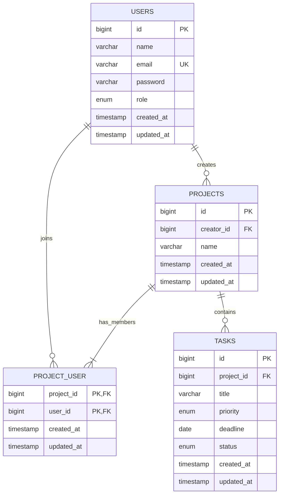

# Entity Relationship & Database Design — JARA

## 1. Model Data

Empat tabel cukup untuk requirement: `users`, `projects`, `project_user`, dan `tasks`. Pivot `project_user` merepresentasikan membership tanpa role/status invitation. Progress tidak disimpan karena merupakan hasil perhitungan status task.

## 2. Logical Schema

### `users`

| Column | Laravel / MySQL | Null | Default | Constraint / Index | Alasan |
|---|---|---:|---|---|---|
| `id` | `id()` / BIGINT UNSIGNED | No | auto | PK | Laravel convention. |
| `name` | `string()` / VARCHAR(255) | No | — | — | Nama tampilan akun. |
| `email` | `string()` / VARCHAR(255) | No | — | UNIQUE | Identitas login dan collaborator; reusable setelah hard delete. |
| `password` | `string()` / VARCHAR(255) | No | — | — | Menyimpan hash. |
| `role` | `enum(['admin','user'])` | No | `user` | INDEX opsional, tidak diperlukan untuk skala praktikum | Role global. |
| `created_at`, `updated_at` | `timestamps()` | Yes | NULL | — | Audit teknis Laravel. |

Catatan: tabel password-reset/session database tidak diperlukan karena reset password dan database session tidak termasuk requirement.

### `projects`

| Column | Laravel / MySQL | Null | Default | Constraint / Index | Alasan |
|---|---|---:|---|---|---|
| `id` | `id()` | No | auto | PK | Identifier. |
| `creator_id` | `foreignId()->constrained('users')->cascadeOnDelete()` | No | — | FK + index | Menyimpan creator; provisional rule menghapus project saat creator dihapus. |
| `name` | `string()` | No | — | — | Nama project. |
| timestamps | `timestamps()` | Yes | NULL | — | Laravel convention. |

### `project_user`

| Column | Laravel / MySQL | Null | Default | Constraint / Index | Alasan |
|---|---|---:|---|---|---|
| `project_id` | `foreignId()->constrained()->cascadeOnDelete()` | No | — | FK, composite UNIQUE/PK | Membership ikut hilang saat project dihapus. |
| `user_id` | `foreignId()->constrained()->cascadeOnDelete()` | No | — | FK, composite UNIQUE/PK | Membership ikut hilang saat akun dihapus. |
| timestamps | `timestamps()` | Yes | NULL | — | Waktu penambahan member. |

Gunakan `primary(['project_id','user_id'])` atau unique composite. Kontrak memilih composite primary key; jangan tambahkan kolom `id`.

### `tasks`

| Column | Laravel / MySQL | Null | Default | Constraint / Index | Alasan |
|---|---|---:|---|---|---|
| `id` | `id()` | No | auto | PK | Identifier. |
| `project_id` | `foreignId()->constrained()->cascadeOnDelete()` | No | — | FK + index | Task wajib berada dalam project dan ikut terhapus. |
| `title` | `string()` | No | — | — | Informasi utama task. |
| `priority` | `enum(['low','medium','high'])` | No | `medium` | — | Tiga nilai requirement; default adalah assumption UI paling sederhana. |
| `deadline` | `date()` | Yes | NULL | — | Tenggat opsional, date-only. |
| `status` | `enum(['not_done','in_progress','done'])` | No | `not_done` | — | Status completion tunggal. |
| timestamps | `timestamps()` | Yes | NULL | — | Laravel convention. |

## 3. Relationships

- `User::createdProjects()` → one-to-many ke `Project`, FK `creator_id`.
- `User::projects()` ↔ `Project::members()` → many-to-many melalui `project_user`, dengan timestamps.
- `Project::creator()` → belongs-to `User`.
- `Project::tasks()` → one-to-many ke `Task`.
- `Task::project()` → belongs-to `Project`.
- Setiap project baru harus membuat pivot creator dalam transaction; schema saja tidak dapat memastikan creator selalu ada di pivot.

## 4. Laravel Migration Plan

Urutan wajib:

1. `create_users_table` — sesuaikan migration bawaan: tambah `role`; jangan tambah tabel auth lain yang tidak digunakan.
2. `create_projects_table` — bergantung pada `users`.
3. `create_project_user_table` — bergantung pada `projects` dan `users`.
4. `create_tasks_table` — bergantung pada `projects`.

Semua schema dibuat melalui `php artisan migrate`; tidak ada perubahan manual phpMyAdmin. Untuk perubahan setelah branch foundation ter-merge, buat migration baru dan jangan mengedit migration yang sudah dipakai tim tanpa koordinasi PM.

## 5. Delete Behaviour

| Delete | Dampak cascade |
|---|---|
| User biasa/collaborator | Pivot membership miliknya terhapus. |
| User yang menjadi creator | Project ciptaannya terhapus; task dan seluruh membership project tersebut ikut terhapus. |
| Project | Semua `tasks` dan `project_user` terkait terhapus. |
| Task | Hanya row task tersebut terhapus. |

Seluruh delete adalah hard delete; tidak ada `deleted_at`/SoftDeletes.

## 6. Seeder / Factory Plan

- `AdminUserSeeder`: membuat satu admin development dengan `updateOrCreate` berdasarkan email `admin@jara.test`, name `JARA Admin`, role `admin`, password `password` yang di-hash. Credential hanya untuk local/praktikum dan didokumentasikan.
- `DatabaseSeeder` memanggil `AdminUserSeeder`.
- `UserFactory`, `ProjectFactory`, dan `TaskFactory` opsional untuk automated test, bukan prasyarat menjalankan aplikasi.
- Tidak perlu seed project/task default; empty state merupakan acceptance path.

## 7. Schema Decisions yang Dikunci

- Table/column/enum persis seperti di dokumen ini.
- Tidak ada tabel `collaborators`, `roles`, `statuses`, `priorities`, `invitations`, atau `project_progress`.
- Perubahan creator deletion atau penambahan username hanya boleh dilakukan setelah PM menyelesaikan BC-01/BC-02 dan memperbarui semua contract.
